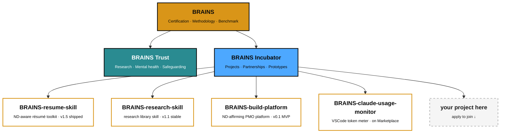

<div align="center">

<picture>
  <source media="(prefers-color-scheme: dark)" srcset="https://raw.githubusercontent.com/shard-BRAINS/.github/main/profile/brand-mark-dark-bg.png">
  
</picture>

# BRAINS

### The global benchmark for neuro-affirming AI.

<br />

[](mailto:info@brainscertified.com?subject=Incubator%20application%20%E2%80%94%20%5Byour%20name%5D)
[](https://discord.gg/BEmTXXscBr)
[](https://brainscertified.com)
[](https://bsky.app/profile/brainscertified.com)
[](mailto:info@brainscertified.com)

<br />

[Apply to join the Incubator ↓](#apply-to-join-the-incubator)

</div>

---

## What BRAINS is

BRAINS exists because the people who built today's AI did not design for the people most affected by it.

We benchmark and certify AI systems against a methodology developed **with**, not just **for**, neurodivergent people. The work is intentionally rigorous and intentionally public — scoring rubrics, methodology notes, and findings are shared so they can be challenged, improved, and built on.

> **Reliable, affirming, inclusive.**

---

## The umbrella



| | Focus |
|---|---|
|  | Certification, methodology, the public benchmark. |
|  | Research, mental health, safeguarding. |
|  | New projects, partnerships, prototypes — including community-led builds. |

---

## The BRAINS Incubator

The Incubator is where new neurodivergent-affirming tools get built. Some are internal R&D; many are community-led projects that grow under the BRAINS umbrella with brand, methodology, and (where possible) operational support.

We're looking for contributors — coders, designers, researchers, writers, lived-experience experts, and people who simply care about getting this right.

### Live projects

| Project | Status | What it is |
|---|---|---|
| **[BRAINS-resume-skill](https://github.com/shard-BRAINS/BRAINS-resume-skill)** |  | Neurodivergence-aware résumé toolkit: ATS-safety, ND-bias auditing, disclosure-decision coaching, career-change translation. |
| **[BRAINS-research-skill](https://github.com/shard-BRAINS/BRAINS-research-skill)** |  | Claude Code skill that maintains the BRAINS research library — extract, dedupe, categorise, file PDFs into a locked taxonomy, plus a per-paper review workflow. |
| **[BRAINS-build-platform](https://github.com/shard-BRAINS/BRAINS-build-platform)** |  | Neurodivergence-affirming PMO platform: work-package decomposition, subagent-driven execution, scrum cadence, decision logging. |
| **[BRAINS-claude-usage-monitor](https://github.com/shard-BRAINS/BRAINS-claude-usage-monitor)** |  | VSCode extension that reads Claude Code transcripts locally and shows your rolling 5-hour and 7-day token usage. No network, no telemetry. |
| _your project_ |  | Have an idea? Apply below with a one-paragraph pitch. |

More in the pipeline. Some of them might be yours.

### Standards & infrastructure

| | |
|---|---|
| **[BRAINS-template-repo](https://github.com/shard-BRAINS/BRAINS-template-repo)** | The starter for every new BRAINS repo. Ships the security, accessibility, and readability checks we run on our own code: OpenSSF Scorecard, CodeQL, Trivy, Gitleaks, Dependabot, Vale with the BRAINS rule pack, and a Flesch-Kincaid readability gate. |

---

## Apply to join the Incubator

<div align="center">

[](mailto:info@brainscertified.com?subject=Incubator%20application%20%E2%80%94%20%5Byour%20name%5D)

</div>

If you'd like to work on an existing Incubator project, or propose a new one, send an email to **[info@brainscertified.com](mailto:info@brainscertified.com?subject=Incubator%20application%20%E2%80%94%20%5Byour%20name%5D)** with the following:

```
Subject: Incubator application — [your name]

1. Who you are
   Name, location, anything about you that's relevant. Pronouns welcome.

2. What you'd want to work on
   An existing project (which one), a new project you'd like to start
   (a paragraph on what and why), or just "open to ideas — here's what
   interests me."

3. What you'd contribute
   Skills, experience, or perspective you bring. Lived experience is
   expertise — say so if it shapes your view of this work.

4. Time you can give
   Honest estimate. Five hours a month is welcome. Twenty hours a week
   is welcome. Both work.

5. Anything else
   Adjustments you'd want for working with us, questions you have,
   things we should know.
```

We respond to every application within seven (7) working days. There is no diagnosis requirement and no formal qualification requirement. We assume good faith on first read.

---

## How we work

| | |
|---|---|
|  | Written communication is the default. Real-time meetings are short and have agendas. |
|  | Reasonable adjustments are offered without diagnosis or justification. |
|  | "Autistic person" by default; flex to person-first when individuals request it. |
|  | Claims about AI behaviour cite the test and the data. |
|  | The neurodivergent contributor is the assumed contributor, not the edge case. |

For the long version, see the [BRAINS Code of Conduct](CODE_OF_CONDUCT.md).

---

## Contact

- **Apply / propose a project:** [info@brainscertified.com](mailto:info@brainscertified.com?subject=Incubator%20application%20%E2%80%94%20%5Byour%20name%5D)
- **Community:** [Discord — discord.gg/BEmTXXscBr](https://discord.gg/BEmTXXscBr)
- **Web:** [brainscertified.com](https://brainscertified.com)
- **Bluesky:** [@brainscertified.com](https://bsky.app/profile/brainscertified.com)
- **Press:** [info@brainscertified.com](mailto:info@brainscertified.com?subject=Press%20enquiry%20%E2%80%94%20%5Boutlet%5D)

---

<div align="center">

<br />

**Built by neurodivergent minds, for neurodivergent people.**

<br />

[](https://brainscertified.com)

</div>
